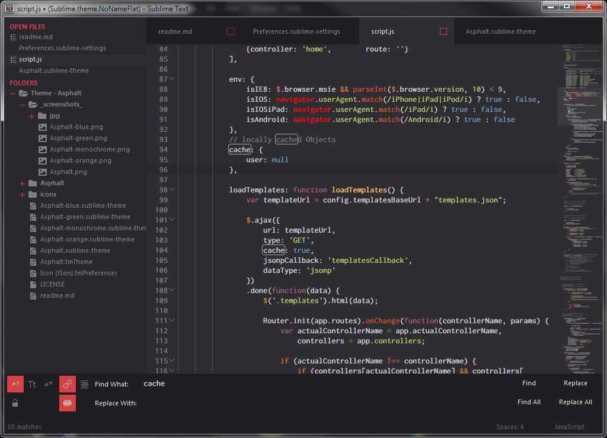
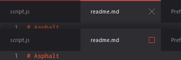

# Asphalt

Minimal and flat dark UI for Sublime Text 3 + custom syntax highlighting Colour Scheme.

***

#### Key features

* 5 UI colour variations
* Custom UI icons (bottom panels, buttons, sidebar icons, etc.)
* Sidebar folder/files icons support (ST3 build 3062+), standard icons (bonus: JSON file type icon and .tmPreference)
* Custom syntax highlighting colour scheme
* Retina display support

***

Asphalt takes inspiration from the great work of (in alphabetical order):
* [itsthatguy's Theme - Itg.Flat](https://github.com/itsthatguy/theme-itg-flat),
* [kkga's Theme - Spacegray](https://github.com/kkga/spacegray),
* [yabatadesign's Theme - Afterglow](http://yabatadesign.github.io/afterglow-theme/).

Asphalt Syntax Colour Scheme derived and extended from:
* [chriskempson's Base16](https://github.com/chriskempson/base16)

***

## UI Colour Variations

#### Asphalt (default)



Red on grey colour variation (default)
[full size image](https://raw.githubusercontent.com/Orlmente/Theme-Asphalt/master/_screenshots_/Asphalt.png)

#### Asphalt Orange


Orange on grey colour variation
[full size image](https://raw.githubusercontent.com/Orlmente/Theme-Asphalt/master/_screenshots_/Asphalt-orange.png)

#### Asphalt Green


Green on grey colour variation
[full size image](https://raw.githubusercontent.com/Orlmente/Theme-Asphalt/master/_screenshots_/Asphalt-green.png)

#### Asphalt Blue


Blue on grey colour variation
[full size image](https://raw.githubusercontent.com/Orlmente/Theme-Asphalt/master/_screenshots_/Asphalt-blue.png)

#### Asphalt Monochrome


Greyscale only colour variation
[full size image](https://raw.githubusercontent.com/Orlmente/Theme-Asphalt/master/_screenshots_/Asphalt-monochrome.png)

***

*The font used in the screenshots is [__Inconsolata-dz__](http://nodnod.net/2009/feb/12/adding-straight-single-and-double-quotes-inconsola/).*

***

### How to Install

#### Via Package Control

The easiest way to install is using [Sublime Package Control](https://sublime.wbond.net/).

* Open `Command Palette` using menu item `Tools -> Command Palette...`, or `Cmd+Shift+P` (OS X) `Ctrl+Shift+P` (Win/Linux)
* Type `Package Control: Install Package`
* Search `Theme - Asphalt`


#### Manual

You can also install the theme manually:

1. [Get the .zip](https://github.com/Orlmente/Theme-Asphalt/archive/master.zip)
2. Unzip and rename the folder to `Theme - Asphalt`
3. Copy the folder into `Packages` directory, which you can find using the menu item `Sublime Text -> Preferences -> Browse Packages...`

or

1. Open your ST `Packages` directory, found under `Sublime Text -> Preferences -> Browse Packages...` menu
2. Clone the repo with this command:

```
git clone https://github.com/Orlmente/Theme-Asphalt "Theme - Asphalt"
```

***

### How to Activate

Activate this theme and color scheme by modifying your user preferences file, found under `Sublime Text -> Preferences -> Settings - User` menu.

Once User's settings are opened, just add the following code *(Restart Sublime Text after activating the theme)*.

**Important: Don't forget to double-check for missing or trailing commas in preference file before saving the file!**

#### Default setup

```json
{
    "color_scheme": "Packages/Theme - Asphalt/Asphalt.tmTheme",
    "theme": "Asphalt.sublime-theme",
}
```

***

#### Alternative colour variations

```json
{
    "theme": "Asphalt-monochrome.sublime-theme",
    "theme": "Asphalt-green.sublime-theme",
    "theme": "Asphalt-blue.sublime-theme",
    "theme": "Asphalt-orange.sublime-theme",
}
```

***

#### Addictional settings 
*("setting_name": "default value", // "alternative value" )*

Enable/Disable Sidebar icons
```json
{
    "theme_asphalt_hide_sidebar_icons": false, // true
}
```


***
Enable tab scrolling via mousewheel
```json
{
    "theme_asphalt_mouse_tabs_switch": false, // true
}
```
Enable dirty tabs indicator
```json
{
    "theme_asphalt_show_dirty_tabs": false, // true
}
```


***
Enable previous entries selection dropdown for input fields and close button for bottom panels
```json
{
    "theme_asphalt_show_input_dropdowon": false, // true
    "theme_asphalt_show_panel_close": false, // true
}
```


***
Higher or lower padding for entries in sidebar
```json
{
    "theme_asphalt_sidebar_big": false, // true
    "theme_asphalt_sidebar_small": false, // true
}
```


***
Brighter colour for text in statusbar
```json
{
    "theme_asphalt_status_bar_brighter": false, // true
}
```
Taller or smaller tabs
```json
{
    "theme_asphalt_tabs_big": false, // true
    "theme_asphalt_tabs_small": false, // true
}
```


***

### License

[MIT & WTFPL](https://github.com/Orlmente/Theme-Asphalt/blob/master/LICENSE)
